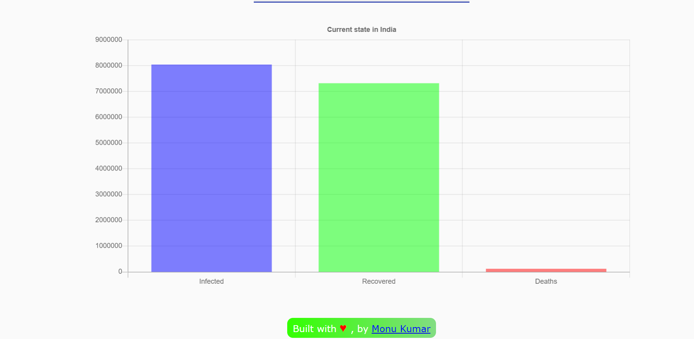

# COVID-19 Dashboard

The project uses an api from 'https://covid19.mathdro.id/api' to render the total number of COVID19 cases globally.
For an individual country the datas are shown through the chart. Hopefully this project finds useful for somebody.
Thank You.

Link to the app: [COVID-19 Dashboard](https://corona-19-details.herokuapp.com/)

# To start this project follow below instructions - 
1. Clone the repo (https://github.com/Monukr14/Covid-19-Dashboard.git)
2. Enter into the project (cd Covid-19-Dashboard)
3. Install dependencies (npm install)
4. Run the project (npm run)
